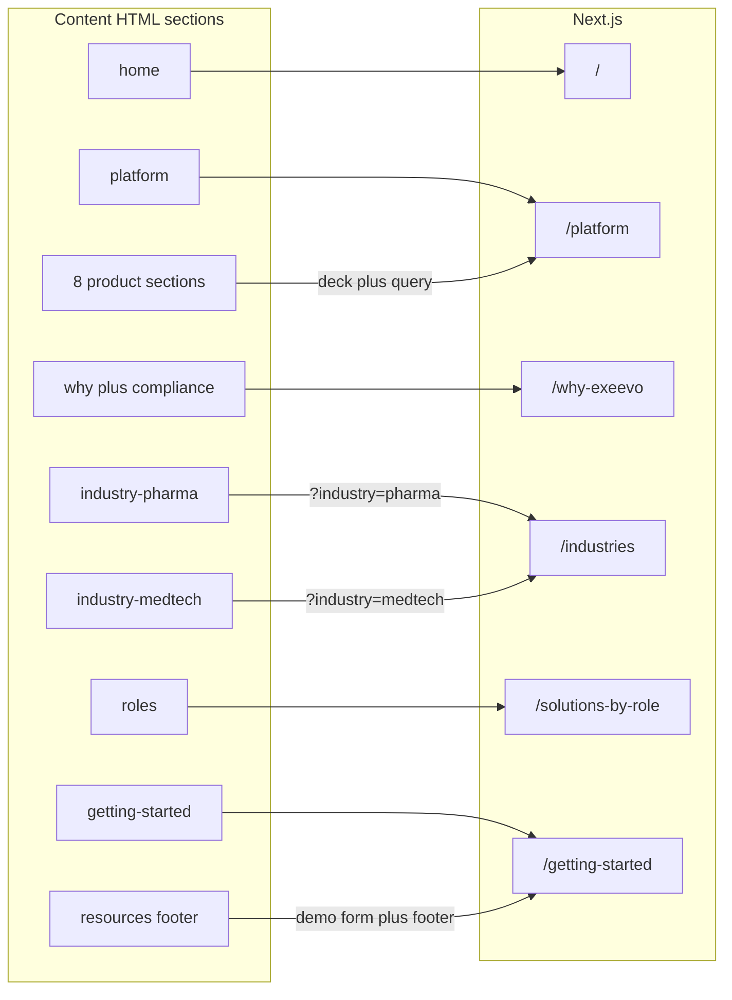

# Clinical Glass marketing site

Greenfield Next.js rebuild of the Exeevo marketing site. Visual source of truth is [exeevo-website-prompt.md](exeevo-website-prompt.md) (Clinical Glass). Copy source of truth is the content HTML (ignore its styling). WordPress is gone; no redirects. Analytics and extra SEO work come later.

## Decisions already locked

- **Six routes only:** `/`, `/platform`, `/why-exeevo`, `/industries`, `/solutions-by-role`, `/getting-started`
- **Eight product sections** from the content HTML live in the Platform module explorer (`/platform?module=<slug>`), not as standalone pages
- **No Resources nav item.** Footer still shows About, Case Studies, Privacy, Cookie Policy, and Site Map as visible `[URL]` placeholders
- **Get a demo** always goes to `/getting-started#demo` (the content HTML pointed this at the footer; the brief replaces that with a real form)
- **Motion:** CSS `animation-timeline: view()` scroll reveals plus Motion for deck, role panels, industry switch, and page transitions. No GSAP/Lenis/WebGL

## Content HTML → routes



Copy is used verbatim from the content HTML / brief section 9. Brief-only UI that is **not** in the content HTML still gets built (it is design, not invented claims):

- Home specimen, three hero cards, video secondary CTA (`[VIDEO URL]`), tenant diagram, go-live band
- Platform 3D deck + rail + detail panel
- Why Exeevo compliance tiles, comparison `<table>`, concentric tenant diagram
- Industries 3D capsule / diagnostic device + segmented control
- Role panels (`flex-grow` accordion)
- Getting Started Core/Enterprise chips + Zod demo form

Never invent stats, customers, logos, or testimonials. Missing facts stay as square-bracket placeholders.

## Stack (from the brief)

Empty repo today (only `AGENTS.md` + the prompt). Scaffold:

- Next.js latest App Router, TypeScript `strict`, pnpm
- Tailwind CSS v4 tokens in [app/styles/tokens.css](app/styles/tokens.css); glass/orb/motion in `app/styles/*.css`
- `motion/react`, `lucide-react` (stroke 1.8), React Hook Form + Zod
- `next/font/google`: Sora + Figtree
- Playwright + `@axe-core/playwright`
- No extra libraries

## File map

```
app/layout.tsx, template.tsx, page.tsx
app/platform/page.tsx
app/why-exeevo/page.tsx
app/industries/page.tsx
app/solutions-by-role/page.tsx
app/getting-started/page.tsx
app/api/demo/route.ts
app/sitemap.ts, robots.ts
app/styles/{tokens,glass,specimen,motion}.css
components/layout/{Nav,MegaMenu,MobileMenu,Footer,ScrollProgress}.tsx
components/ui/{Button,IconButton,TextLink,Chip,CategoryDot,SegmentedControl,Checklist,Field,Select}.tsx
components/glass/{GlassPanel,Orb,Specimen,Glow}.tsx
components/sections/  one file per section
content/{site,modules,compliance,comparison,industries,roles,paths}.ts
public/brand/{exeevo-icon,exeevo-wordmark-white,exeevo-wordmark-slate}.png
tests/{smoke,a11y}.spec.ts
```

`"use client"` only on Nav, MegaMenu, MobileMenu, ModuleDeck, RolePanels, IndustrySwitcher, DemoForm, and `app/template.tsx`. All marketing copy lives in `content/*.ts` and is passed in as props.

## Nav and conversion

Nav links: Platform (mega menu of 8 modules), Industries, Solutions by role, Why Exeevo, Getting started, then **Get a demo**. No Resources.

Mega menu matches the content HTML module list and short descriptions. Active page uses `aria-current="page"`. Below 1024px: logo, Get a demo, menu sheet.

## SEO / analytics later (hooks only)

- Per-page `metadata` (title + description) so we are not blocked later
- `sitemap.ts` + `robots.ts` for the six routes
- Organization JSON-LD in the root layout
- **No** GTM, cookie banner, or analytics scripts in this build
- Module URLs stay `?module=` as specified; can add path aliases later without a redesign

## Brand assets

The brief expects three PNGs in `public/brand/`. They are not in the repo. During scaffold we will pull them from [Exeevo Brand Guidelines_v0_January_2024.pdf](/Users/owner/Downloads/Exeevo%20Brand%20Guidelines_v0_January_2024.pdf) if extractable; otherwise a Sora text wordmark plus a gradient orb icon until you drop the files in.

## Demo form

Build the brief’s form even though the content HTML has none:

- Fields: name, work email, company, country, buying-team select, `[Privacy consent copy and link]`
- Client + `app/api/demo/route.ts` share one Zod schema
- POST to `process.env.CRM_FORM_ENDPOINT` (document in `.env.example`; if unset, return a clear 503 so the UI can show an inline error)
- Success replaces the form with “Request received. [CONFIRMATION COPY]”
- Never log personal data

## Motion (must feel clinical, not generic SaaS)

- Hero `rise` stagger once per page
- Scroll: `.sr` / `.srl` / `.srr` / `.srg` / `.srt` / `.ln` / `.d1–d3` inside `@supports (animation-timeline: view())`; unsupported browsers show the final state
- Specimen sphere is the only ambient loop; pause off-screen
- Shared `layoutId="hero-orb"` across heroes
- `prefers-reduced-motion: reduce` disables everything; nothing hidden

## Quality gates (every milestone)

`pnpm lint && pnpm typecheck && pnpm test` must pass. Playwright: every route 200 + h1, nav/footer links, mega menu keyboard, module deck (click, arrows, deep link), role panels, industry toggle, form validation + mocked success, axe with zero serious/critical, both normal and reduced-motion.

Visual check at 390 / 768 / 1024 / 1440.

## Out of scope

Blog, About, case studies, pricing, legal pages, GTM/analytics, WordPress 301s, CMS, real CRM endpoint wiring beyond the env var.
